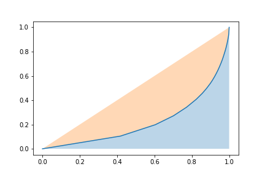

# Rsdiv: Diversity improvement framework for recommender systems
[](https://www.python.org)
[](https://pypi.org/project/rsdiv/)
[](https://github.com/smartnews/rsdiv)

**rsdiv** is a Python package for recommender systems to provide the measurements and improvements for the diversity of results.

Some of its features include:
- various kinds of metrics to measure the diversity of recommender systems from a quantitative view.
- various implementations for diversify algorithms and models.
- various implementations of core recommender algorithms.
- benchmarks for comparing and further analysis.
- hyperparameter optimization based on [Optuna](https://github.com/optuna/optuna).

## Installation
You can simply install the pre-build binaries with:
```
$ pip install rsdiv
```
Or you may want to build from source:
```
$ cd rsdiv && pip install .
```
## Basic Usage
### Prepare for a benchmark dataset
Load a benchmark, say, [MovieLens 1M Dataset](https://grouplens.org/datasets/movielens/1m/). This is a table benchmark dataset which contains 1 million ratings from 6000 users on 4000 movies.
```
>>> import rsdiv as rs
>>> downloader = rs.MovieLens1MDownLoader()
```
Get the user-item interactions (ratings):
```
>>> ratings = downloader.read_ratings()
```
|    |   userId |   movieId |   rating | timestamp           |
|---:|---------:|----------:|---------:|:--------------------|
|  0 |        1 |      1193 |        5 | 2000-12-31 22:12:40 |
|  1 |        1 |       661 |        3 | 2000-12-31 22:35:09 |
|  ... |        ... |      ... |        ... | ... |
| 1000207 |     6040 |      1096 |        4 | 2000-04-26 02:20:48|
| 1000208 |     6040 |      1097 |        4 | 2000-04-26 02:19:29|

Get the users' infomation:
```
>>> users = downloader.read_users()
```
|    |   userId | gender   |   age |   occupation |   zipcode |
|---:|---------:|:---------|------:|-------------:|----------:|
|  0 |        1 | F        |     1 |           10 |     48067 |
|  1 |        2 | M        |    56 |           16 |     70072 |
|  ... |        ... | ...        |    ... |     ... |   ... |
| 6038 |     6039 | F        |    45 |            0 |     01060 |
| 6039 |     6040 | M        |    25 |            6 |     11106 |

Get the items' information:
```
>>> movies = downloader.read_items()
```
|    |   movieId | title      | genres      |   release_date |
|---:|----------:|:--------------|:-------|-------:|
|  0 |         1 | Toy Story   | [\'Animation\', "Children\'s", \'Comedy\']  |   1995 |
|  1 |         2 | Jumanji      | [\'Adventure\', "Children\'s", \'Fantasy\'] |   1995 |
|  ... |   ... | ... | ...     |   ... |
| 3881 | 3951 | Two Family House | ['Drama'] |   2000 |
| 3882 | 3952 | Contender, The   | ['Drama', 'Thriller'] |  2000 |

### Evaluate the results in various aspects
Load the evaluator to analyse the results, say, [Gini coefficient](https://en.wikipedia.org/wiki/Gini_coefficient) metric:
```
>>> metrics = rs.DiversityMetrics()
>>> metrics.gini_coefficient(ratings['movieId'])

>>> 0.6335616301416965
```
The nested input type (`List[List[str]]`-like) is also favorable. This is especially usful to evaluate the diversity on topic-scale:
```
>>> metrics.gini_coefficient(movies['genres'])

>>> 0.5158655846858095
```

[Shannon Index](https://en.wikipedia.org/wiki/Diversity_index#Shannon_index) and [Effective Catalog Size](https://www.businessinsider.com/how-netflix-recommendations-work-2016-9) are also available with same usage.

### Draw a Lorenz curve graph for insights
[Lorenz curve](https://en.wikipedia.org/wiki/Lorenz_curve) is a graphical representation of the distribution, the cumulative proportion of species is plotted against the cumulative proportion of individuals. This feature is also supported by **rsdiv** for helping practitioners' analysis.
```
metrics.get_lorenz_curve(ratings['movieId'])
```


### Train a recommender
TODO.

### Improve the diversity
TODO.

## For developers
Make sure you have `pre-commit` installed:
```
pip install pre-commit
pre-commit install
```
