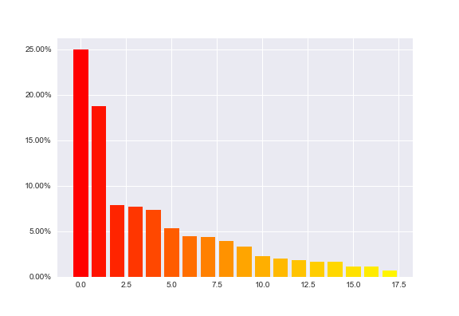
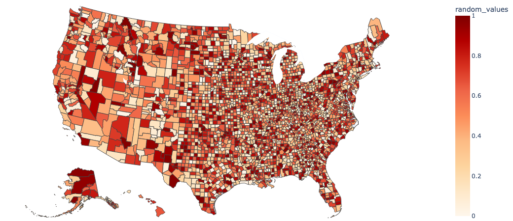

# Rsdiv: Diversity improvement framework for recommender systems

[](https://www.python.org)
[](https://pypi.org/project/rsdiv/)
[](https://github.com/smartnews/rsdiv)

**rsdiv** is a Python package for recommender systems to provide the measurements and improvements for the diversity of results.

Some of its features include:

- various kinds of metrics to measure the diversity of recommender systems from a quantitative view.
- various implementations for diversifying algorithms and models.
- various implementations of core recommender algorithms.
- benchmarks for comparing and further analysis.
- hyperparameter optimization based on [Optuna](https://github.com/optuna/optuna).

## Installation

You can simply install the pre-build binaries with:

```bash
pip install rsdiv
```

Or you may want to build from the source:

```bash
cd rsdiv && pip install .
```

## Basic Usage

### Prepare for a benchmark dataset

Load a benchmark, say, [MovieLens 1M Dataset](https://grouplens.org/datasets/movielens/1m/). This is a table benchmark dataset that contains 1 million ratings from 6000 users on 4000 movies.

```python
>>> import rsdiv as rs
>>> loader = rs.MovieLens1MDownLoader()
```

Get the user-item interactions (ratings):

```python
>>> ratings = loader.read_ratings()
```

|    |   userId |   movieId |   rating | timestamp           |
|---:|---------:|----------:|---------:|:--------------------|
|  0 |        1 |      1193 |        5 | 2000-12-31 22:12:40 |
|  1 |        1 |       661 |        3 | 2000-12-31 22:35:09 |
|  ... |        ... |      ... |        ... | ... |
| 1000207 |     6040 |      1096 |        4 | 2000-04-26 02:20:48|
| 1000208 |     6040 |      1097 |        4 | 2000-04-26 02:19:29|

Get the users' information:

```python
>>> users = loader.read_users()
```

|    |   userId | gender   |   age |   occupation |   zipcode |
|---:|---------:|:---------|------:|-------------:|----------:|
|  0 |        1 | F        |     1 |           10 |     48067 |
|  1 |        2 | M        |    56 |           16 |     70072 |
|  ... |        ... | ...        |    ... |     ... |   ... |
| 6038 |     6039 | F        |    45 |            0 |     01060 |
| 6039 |     6040 | M        |    25 |            6 |     11106 |

Get the items' information:

```python
>>> items = loader.read_items()
```

|    |   movieId | title      | genres      |   release_date |
|---:|----------:|:--------------|:-------|-------:|
|  0 |         1 | Toy Story   | [\'Animation\', "Children\'s", \'Comedy\']  |   1995 |
|  1 |         2 | Jumanji      | [\'Adventure\', "Children\'s", \'Fantasy\'] |   1995 |
|  ... |   ... | ... | ...     |   ... |
| 3881 | 3951 | Two Family House | ['Drama'] |   2000 |
| 3882 | 3952 | Contender, The   | ['Drama', 'Thriller'] |  2000 |

### Evaluate the results in various aspects

Load the evaluator to analyze the results, say, the [Gini coefficient](https://en.wikipedia.org/wiki/Gini_coefficient) metric:

```python
>>> metrics = rs.DiversityMetrics()
>>> metrics.gini_coefficient(ratings['movieId'])
>>> 0.6335616301416965
```

The nested input type (`List[List[str]]`-like) is also favorable. This is especially useful to evaluate the diversity on the topic scale:

```python
>>> metrics.gini_coefficient(items['genres'])
>>> 0.5158655846858095
```

[Shannon Index](https://en.wikipedia.org/wiki/Diversity_index#Shannon_index) and [Effective Catalog Size](https://www.businessinsider.com/how-netflix-recommendations-work-2016-9) are also available with the same usage.

### Show the distribution of a given data source

The unbalance of the data distribution can be well illustrated by both barplot and sorted DataFrame:

```python
>>> distribution = metrics.get_distribution(items['genres'])
```



```python
>>> distribution
```

|    | category    |   percentage |
|---:|:------------|-------------:|
|  0 | Drama       |   0.250156   |
|  1 | Comedy      |   0.187266   |
|  2 | Action      |   0.0784956  |
|  ... | ...    |   ...   |
| 16 | Western     |   0.0106117  |
| 17 | Film-Noir   |   0.00686642 |

### Draw a Lorenz curve graph for insights

[Lorenz curve](https://en.wikipedia.org/wiki/Lorenz_curve) is a graphical representation of the distribution, the cumulative proportion of species is plotted against the cumulative proportion of individuals. This feature is also supported by **rsdiv** for helping practitioners' analysis.

```python
metrics.get_lorenz_curve(ratings['movieId'])
```


### Evaluate the unbalance from a sense of location

**rsdiv** provides the encoders including geography encoding function to improve the intuitive understanding for practitioners, to start with the random values:

```python
>>> geo = rs.GeoEncoder()
>>> df = geo.read_source()
>>> rng = np.random.RandomState(42)
>>> df['random_values'] = rng.rand(len(df))
>>> geo.draw_geo_graph(df, 'random_values', 'name')
```



### Train a recommender

**rsdiv** provides various implementations of core recommender algorithms. To start with, a wrapper for `LightFM` is also supported:

```python
>>> rc = rs.FMRecommender(ratings, items, 0.3).fit()
```

30% of interactions are split for the test set, and the precision at the `top 5` can be calculated with:

```python
>>> rc.precision_at_top_k(5)
>>> 0.15639074
```

the `top 100` unseen recommended items for an arbitrary user, say `userId: 1024`, can be simply given by:

```python
>>> rc.predict_top_n_item(1024, 100)
```

|    |   itemId |   scores | title                                   | genres                                          |   release_date |
|---:|------:|---------:|:-----------|:-----------|---------------:|
|  0 |      916 | 1.77356  | Roman Holiday                           | [\'Comedy\', \'Romance\']                           |           1953 |
|  1 |     1296 | 1.74696  | Room with a View                        | [\'Drama\', \'Romance\']                            |           1986 |
|  ... |     ... | ...  | ...       | ...                |       ... |
|  98 |     3079 | 0.371897  | Mansfield Park                        | [\'Drama\']                            |           1999 |
|  99 |     2570 | 0.369199  | Walk on the Moon                      | [\'Drama\', \'Romance\']                            |           1999 |

### Improve the diversity

Not only for categorical labels, but **rsdiv** also supports embedding for items, for example, but the pre-trained 300-dim embedding based on wiki_en by fastText can also be simply imported as:

```python
>>> emb = rs.FastTextEmbedder()
>>> emb.embedding_list(['Comedy', 'Romance'])
>>> array([-0.02061814,  0.06264187,  0.00729847, -0.04322025,  0.04619966, ...])
```

## TODO

- implement the Maximal Marginal Relevance, MMR diversify algorithm
- implement the Bounded Greedy Selection Strategy, BGS diversify algorithm
- implement the Determinantal Point Process, DPP diversify algorithm
- implement the Modified Gram-Schmidt, MGS diversify algorithm

### Hyperparameter optimization

- compatible with [Optuna](https://github.com/optuna/optuna).

## For developers

Contributions welcome! Please contact us.

During your development stage, make sure you have `pre-commit` installed in your local environment:

```bash
pip install pre-commit
pre-commit install
```
